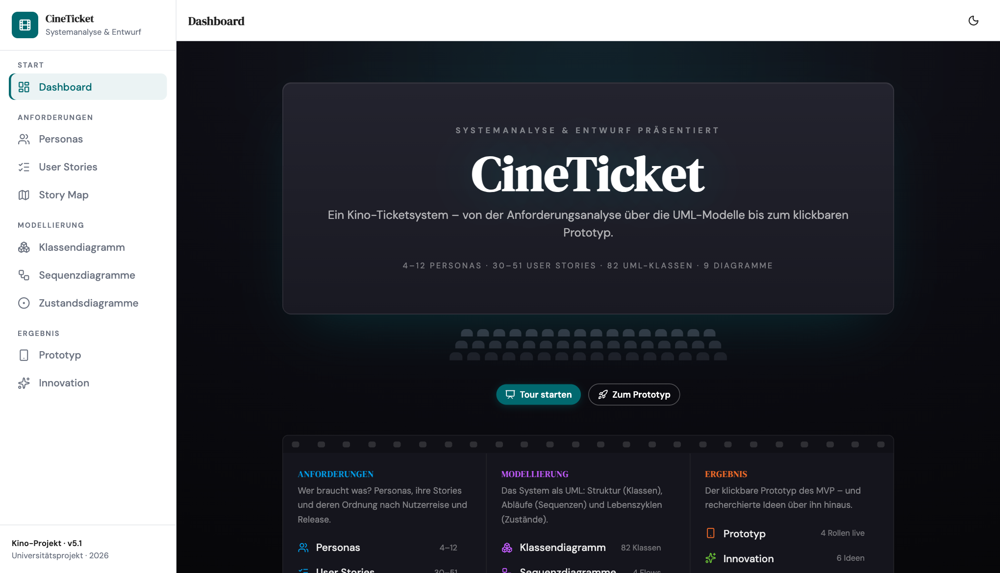
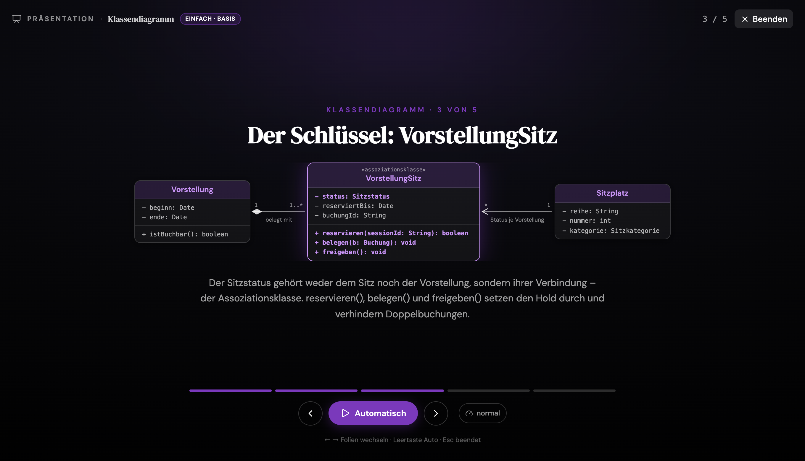

# CineTicket – Projektdokumentations-Website

Interaktive Dokumentations-Website für das Kino-Ticketsystem **CineTicket**,
entstanden im Kurs „Systemanalyse und Entwurf" (2026). Sie führt von der
Anforderungsanalyse über die UML-Modelle bis zum klickbaren Prototyp – alle
Abschnitte teilen dieselbe Datenbasis und dasselbe Designsystem.

**Live:** <https://linusk100.github.io/Kino-Project-Vorbereitung/>



## Was die Website kann

- **Einfach / Erweitert** – jeder Abschnitt hat genau zwei Detailgrade
  (Basis ⊆ Vollausbau). Umschalten oben rechts; global und persistent.
- **Präsentationsmodus („Kino")** – jeder Abschnitt erklärt seine wichtigsten
  Inhalte in einer animierten Vollbild-Tour mit echten Ausschnitten aus den
  Diagrammen. Weiter per Pfeiltasten oder automatisch mit einstellbarem Tempo,
  Esc beendet. Die Tour folgt dem gewählten Modus.
- **Diagramme nativ als SVG** – Klassen-, Sequenz- und Zustandsdiagramme werden
  zur Laufzeit aus JSON gerendert (kein Bild-Export): Auto-Layout via `elkjs`,
  Zoom mit Drag-Panning, „Als Text"-Alternative, Detail-Dialoge.
- **Prototyp** – die echte Hi-Fi-App (React + MSW-Mock-API) ist unter
  `public/prototyp-app/` eingebettet und startet in einem neuen Tab.
- **Dark / Light** – persistent, folgt standardmäßig dem System.



## Abschnitte

| Gruppe | Abschnitte |
|---|---|
| Start | Dashboard (Einstieg: Aufbau, Bedienung, Tour) |
| Anforderungen | Personas · User Stories · Story Map |
| Modellierung | Klassendiagramm · Sequenzdiagramme · Zustandsdiagramme |
| Ergebnis | Prototyp (startet die echte App) · Innovation |
| Projekt | Arbeitsweise (wie die Website entsteht, geprüft und veröffentlicht wird) |

Alle Inhalte stammen aus `src/data/*.json` (übernommen aus der
Projektdokumentation v5.1, je Abschnitt als Basis- und Erweitert-Datensatz).
Kennzahlen auf Folien und Karten werden aus diesen Daten berechnet, nicht
hartkodiert – Website und Dokumentation können nicht auseinanderlaufen.

## Entwicklung

```bash
npm install
npm run dev      # http://localhost:5173/Kino-Project-Vorbereitung/
npm run build    # tsc + vite build -> dist/
npm run lint
```

> **Hinweis zu nativen Binaries:** `npm install` lässt auf manchen Macs die
> `.node`-Dateien von `rolldown`, `lightningcss` und `@tailwindcss/oxide` weg
> (Symptom: `Cannot find module './…darwin-arm64.node'`). In dem Fall
> `node scripts/ensure-native-binaries.mjs` ausführen – das Skript lädt die
> fehlenden Binaries aus der npm-Registry nach.

Deploy: Push auf `main` baut und veröffentlicht die Seite automatisch über
GitHub Actions auf GitHub Pages (`404.html` dient als SPA-Fallback für
Deep-Links).

## Architektur

```
src/
├── data/            JSON (Doku v5.1) + content.ts (typisierte, modusabhängige Selektoren)
├── store/appStore   Theme + Modus (zustand, persistiert)
├── components/
│   ├── layout/      Sidebar (nav.ts), AppShell, TopBar
│   ├── shared/      SectionShell, Callout, ModeToggle, ErrorBoundary
│   ├── presentation/  Kino-Modus (Presentation.tsx) + JSON-getriebene Folien-Visuals (visuals/)
│   └── diagram/     DiagramFrame, ClassDiagram, SequenceDiagram, StateDiagram
├── pages/           ein Page-Modul je Abschnitt (lazy geladen)
└── lib/             statusColors (zentrale Palette), utils
```

Arbeitsnotizen und Entscheidungen: siehe [`docs/`](./docs)
(ARCHITECTURE, PROGRESS mit Changelog, REVIEW_REPORT).

## Tech-Stack

React 19 · Vite (rolldown) · Tailwind v4 · react-router 7 · motion · zustand ·
Radix UI · elkjs · lucide-react
